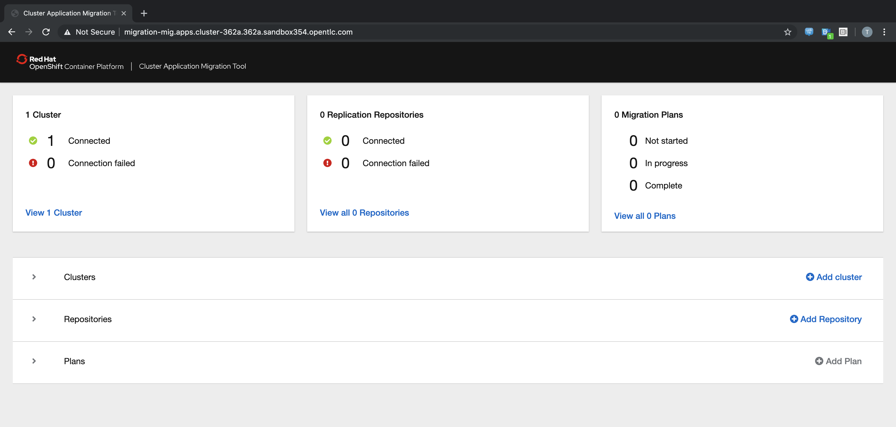
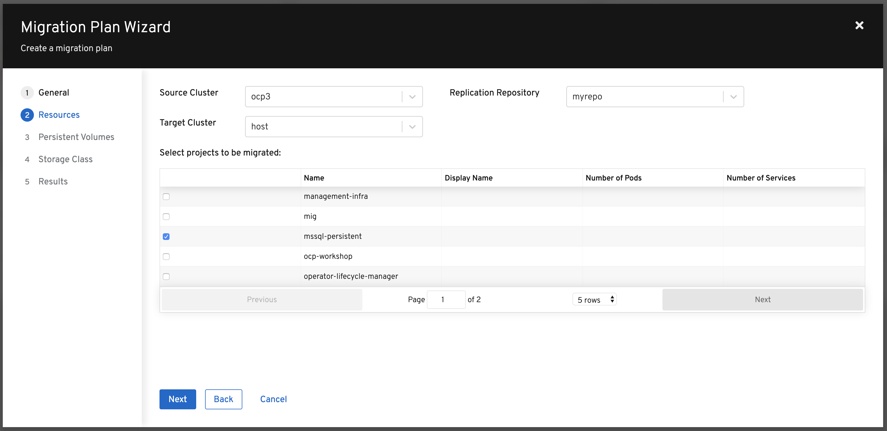
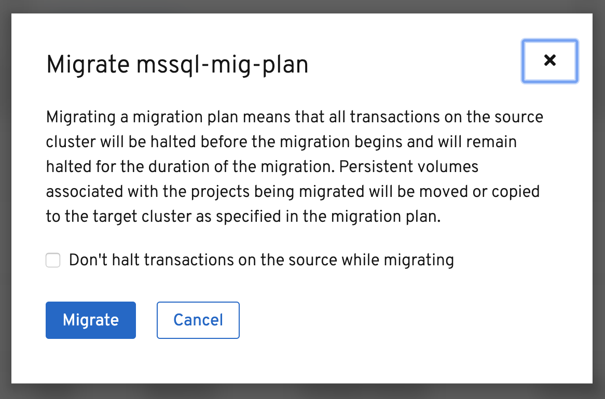
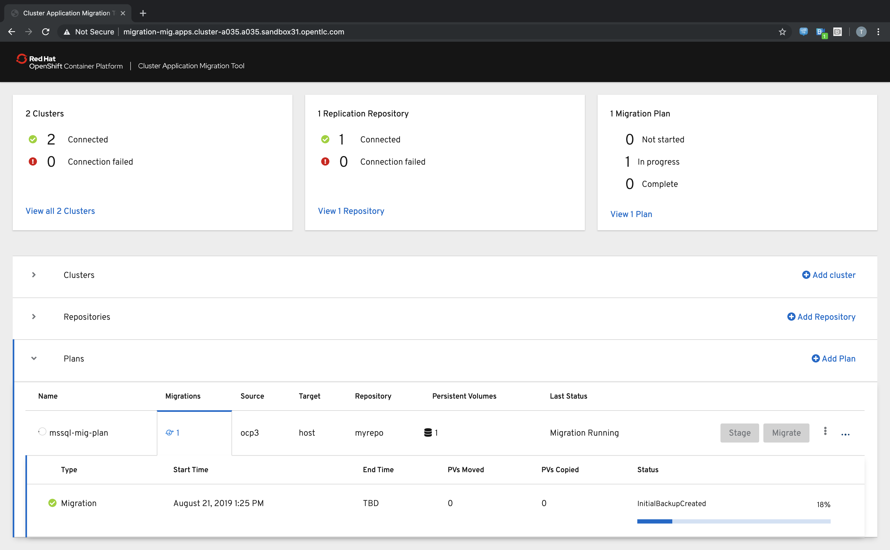
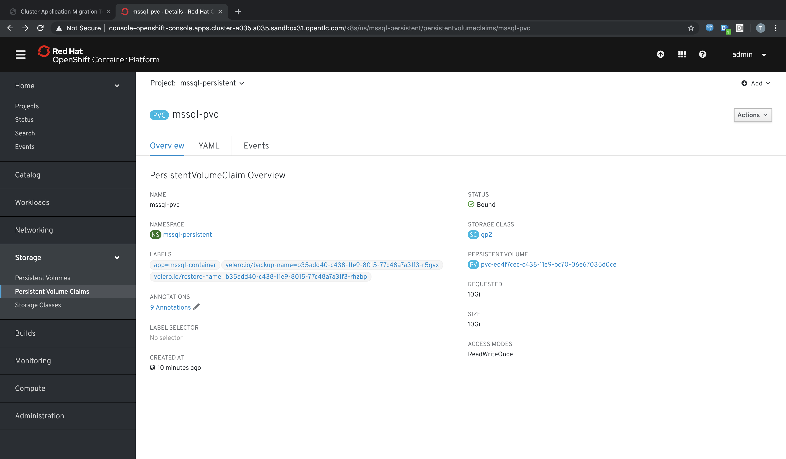
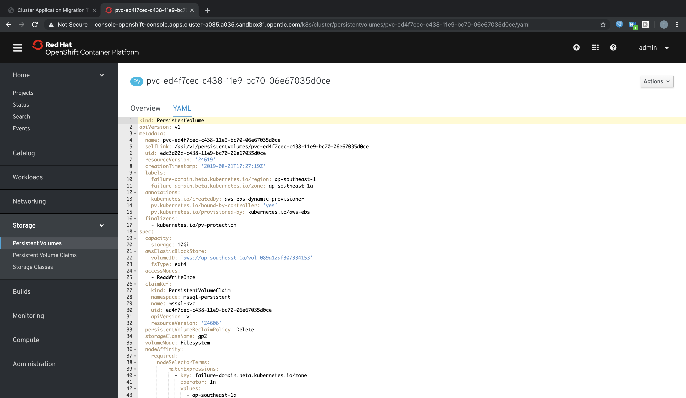

# 5.0 Migrate MSSQL Application

The first application that we are going to migrate is a simple Product Inventory web-based application front-end, backed backed by Microsoft SQL Server.  This application has been pre-deployed on your 3.11 cluster in the mssql-persistent namespace, using a single PV backed by NFS for persistent storage.

If we login to 3.11 cluster, we can see the app running:

```bash
$ oc login https://master1.GUID.DOMAIN> -u admin -p r3dh4t1!
$ oc get pods -n mssql-persistent
NAME                                    READY   STATUS    RESTARTS   AGE
mssql-app-deployment-6ffb46c5d6-n5fvv   1/1     Running   0          41m
mssql-deployment-1-xq4p4                1/1     Running   0          41m
```

Let's get the route to the application, and bring up the webUI.

```bash
$  oc get route -n mssql-persistent
NAME              HOST/PORT                                                       PATH   SERVICES     PORT   TERMINATION   WILDCARD
mssql-app-route   mssql-app-route-mssql-persistent.apps.cd76.events.opentlc.com          db-app-svc   5000                 None
```


Let's go ahead and add a new product to the inventory.  Click on the +Add button and enter some data.


You can see the application is functioning and state is being saved in the DB.  


Let's also verify that the application is NOT installed on our 4.1 destination cluster.  First login to 4.1. You can see that no pods are running; and in fact the mssql-persistent namespace does *not* exist.

```bash
$ oc login https://api.cluster-<GUID>.<GUID>.<DOMAIN>:6443 -u admin -p r3dh4t1!
$ oc get pods -n mssql-persistent
No resources found.
```

## 5.1 Migration Planning with CPMA

In planning our migration, the first step is to check out the CPMA generated report that we created and downloaded in Lab 3.

1. Point your browser to `File:///tmp/cpma/report.html`.

2. Navigate to `Cluster report > Namespaces`

3. Click to open the `PVCs` section.  You'll see that the `mssql-persistent` application has a single PVC defined.  This is for a 10Gig volumes backed by NFS.  We will need to account for this in our Migration Plan.


4. Next, click to open the `SCCs` section.  You'll see that the `mssql-persistent` application makes use of a custom Security Context Constraint.  We know from our CAM overview, that SCCs are not migrated as part of a Migration Plan.  So, we will need to apply the custom SCC onto our 4.1 Cluster prior to migrating the application. Let's do this now. The custom SCC yaml is available [here](./files/mssql-scc.yaml) (right-click Raw, Save Link As if using local machine).  This file is also located on the bastion if desired to create the SCC from there.


### 5.1.1 Create MSSQL Security Context Constraint

1. Run the following to recreate MSSQL's `scc` on the destination 4.1 cluster:
```bash
$ oc login https://api.cluster-<GUID>.<GUID>.<DOMAIN>:6443 -u admin -p r3dh4t1!
$ oc create -f mssql-scc.yaml
securitycontextconstraints.security.openshift.io/mssql-persistent-scc created
```

## 5.2 Using CAM

Next, let's open up the migration UI. Again, to get the route, run the following command on the destination 4.1 cluster:
```bash
$ oc get routes migration -n mig -o jsonpath='{.spec.host}'
 migration-mig.apps.cluster-a21d.a21d.sandbox67.opentlc.com
```

The screen should look something like:



### 5.2.1 Add a Cluster

First thing we want to do is add the source OCP cluster we wish to migrate the
application from. Click `Add cluster`:


Fill out the neccessary information. We will need an Service Account Token in order for destination cluster to talk to source cluster:

`Run the following against your 3.11 cluster.`

```bash
$ oc sa get-token -n mig mig
eyJhbGciOifsfsds8ahmtpZCI6IiJ9fdsfdseyJpc3MiOiJrdWJlcm5ldGVzL3NlcnZpY2VhY2NvdW50Iiwia3ViZXJuZXRlcy5pby9zZXJ2aWNlYWNjb3VudC9uYW1lc3BhY2UiOiJtaWciLCJrdWJlcm5ldGVzLmlvL3NlcnZpY2VhY2NvdW50L3NlY3JldC5uYW1lIjoibWlnLXRva2VuLTdxMnhjIiwia3ViZXJuZXRlcy5pby9zZXJ2aWNlYWNjb3VudC9zZXJ2aWNlLWFjY291bnQubmFtZSI6Im1pZyIsImt1YmVybmss7gc2VydmljZWFjY291bnQvc2VydmljZS1hY2NvdW50LnVpZCI6IjQ5NjYyZjgxLWEzNDItMTFlOS05NGRjLTA2MDlkNjY4OTQyMCIsInN1YiI6InN5c3RlbTpzZXJ2aWNlYWNjb3VudDptaWc6bWlnIn0.Qhcv0cwP539nSxbhIHFNHen0PNXSfLgBiDMFqt6BvHZBLET_UK0FgwyDxnRYRnDAHdxAGHN3dHxVtwhu-idHKI-mKc7KnyNXDfWe5O0c1xWv63BbEvyXnTNvpJuW1ChUGCY04DBb6iuSVcUMi04Jy_sVez00FCQ56xMSFzy5nLW5QpLFiFOTj2k_4Krcjhs8dgf02dgfkkshshjfgfsdfdsfdsa8fdsgdsfd8fasfdaTScsu4lEDSbMY25rbpr-XqhGcGKwnU58qlmtJcBNT3uffKuxAdgbqa-4zt9cLFeyayTKmelc1MLswlOvu3vvJ2soFx9VzWdPbGRMsjZWWLvJ246oyzwykYlBunYJbX3D_uPfyqoKfzA

# We need to save the output of the 'get-token', that is the long string we will enter into the mig-ui when we create a new cluster entry.
```

When done, click `Add Cluster`. You should see a `Connection successful` message. Click `Close`.


Now you should see the source and destination clusters populated.


### 5.2.2 Setup a Minio bucket as a replication repository

Next we want to add a replication repository. Click `Add Repository`:


Fill out the information from the from the bucket we created in Lab 2.  Leave the `S3 Bucket Region` field blank.  Click `Add repository` and you should see a `Connection successful` message. Click `Close`.

***Note:*** 

For Minio:

* S3 Provider Access Key: `minio`
* S3 Provider Secret Access Key: `minio123`


You should now see the repository `myrepo` populated.


### 5.2.3 Create a Migration Plan

Now that we have a replication repository specified and both the source and
destination clusters defined, we can create a migration plan. Click `Add Plan`:


Fill out a plan name. Click Next.



Select the source and target cluster, the replication repository, and the `mssql-persistent` namespace (which we want to migrate over). Click Next.


Now we are displayed a list of persistent volumes associated with our
application workload. Select which type of action you would like to perform on the PV. For this example, let's select `copy`.  Click Next.


Select the storage class for your PVs.  In this case we will be copying our data from NFS to AWS-EBS (`gp2:kubernetes.io/aws-ebs`).  Click Next.


After validating the migration plan, you will see a `Ready` message and you can click `Close`.

### 5.2.4 Migrate the Application Workload

Now we can select `Migrate` or `Stage` on the application. Since we don't care about downtime for this example, let's select `Migrate`:


Optionally choose to *not* terminate the application on the source cluster.
Leave it unchecked and select `Migrate`.



The migration will progress with a progress bar showing each step in the process.



Once done, you should see `Migration Succeeded` on the migration plan.


### 5.2.5 Verify application is functioning on Destination Cluster

Let's first open the OCP 4.1 web console.


Click on the `mssql-persistent` namespace.


Click on the `mssql-app-deployment` deployment object to
retrieve the route.


Open the route and verify the application is functional.


## 5.3 Bonus: Check out copied PV

To verify the application actually copied the PV data over to a new volume,
let's confirm we are no longer using an NFS volume. If everything worked as
expected, our OCP 4.1 cluster will use it's default storage class (gp2) to
provision an AWS EBS volume.

Click on the `Storage` tab in the web console and open `Persistent Volume Claims` in the mssql-persistent namespace.



Click on the persistent volume and verify that it is using Amazon Elastic Block Storage as the provisioner.



## 5.4 Optional - Resetting the Environments

If you are interested in resetting your 3.11 and 4.1 lab environments to enable re-migration of the mssql-persistent application, follow these steps:

`Note: This will only work if PVs are migrated with COPY action.`

1. Delete the `mssql-mig-plan` migration plan via the CAM WebUI.

2. Delete the `mssql-persistent` namespace from your 4.1 cluster.

```bash
$ oc delete project mssql-persistent
project.project.openshift.io "mssql-persistent" deleted
```

2. Redeploy the application on the 3.11 cluster.

```bash
oc scale deploymentconfig mssql-deployment --replicas=1 -n mssql-deployment
oc scale deployment mssql-app-deployment --replicas=1 -n mssql-deployment
```

Next Lab: [Lab 6 - Migrate Sock Shop Application](./6.md)<br>
Previous Lab: [Lab 4 - CAM Overview](./4.md)<br>
[Home](./README.md)
