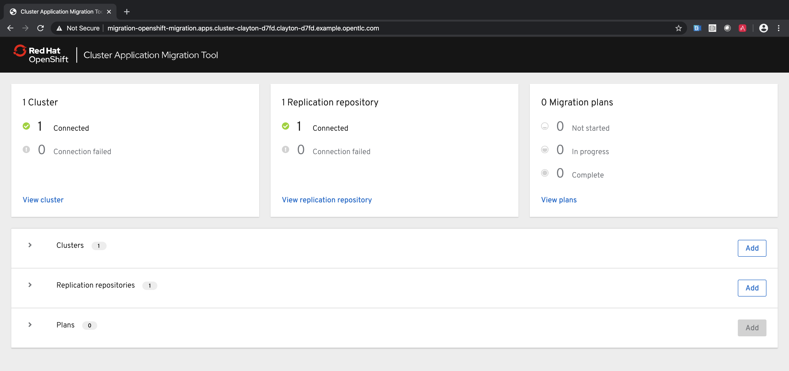
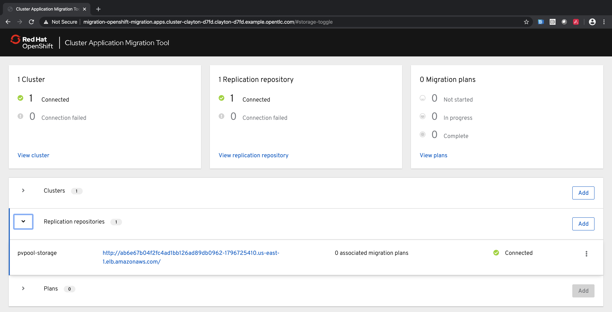
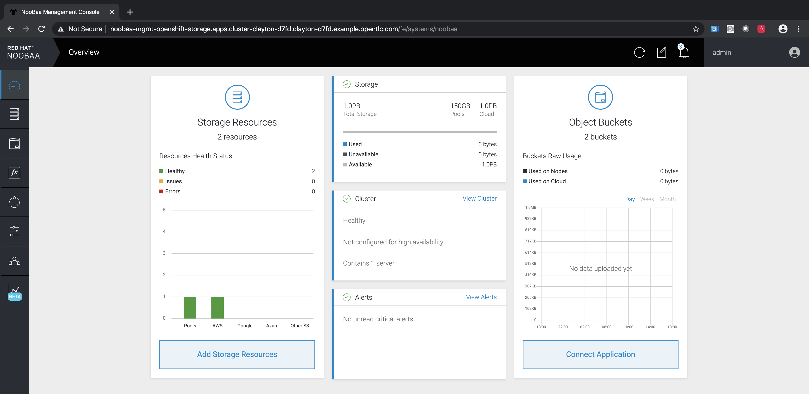

# 2.0 Prerequisites & Setup

Required versions of products used:

| Product         | Versions    |
| -----------     | ----------- |
| OpenShift 3.x   | v3.7+       |
| OpenShift 4.x   | v4.1+       |

Additionally, temporary object storage will be required perform a migration.  For example, this can be provided through: [AWS S3](https://aws.amazon.com/s3/), [Noobaa](https://www.noobaa.io/), [Minio](https://min.io/), or others.

## 2.1 Base requirements

* A computer with access to the Internet :-)
* SSH client
* Firefox 17 or higher, or Chromium / Chrome
* oc client

## 2.2 Accessing 3.11 and 4.3 clusters

As we will be interacting with both the source and destination cluster throughout the course of this lab, let's go ahead and open two terminal windows.  

 The first terminal window will be used for the source 3.11 cluster.  In that window, let's login using the provided coordinates and credentials:

 ```
 $ oc login https://master.GUID.open.redhat.com -u admin -p r3dh4t1!
 The server uses a certificate signed by an unknown authority.
 You can bypass the certificate check, but any data you send to the server could be intercepted by others.
 Use insecure connections? (y/n): y
 ...
 Login successful.
 ```

 The second terminal window will be used for the destination 4.3 cluster. In that window, let's login using the provided coordinates and credentials:

 ```
 $ oc login https://api.cluster-GUID.GUID.example.opentlc.com:6443 -u admin -p r3dh4t1!
 The server uses a certificate signed by an unknown authority.
 You can bypass the certificate check, but any data you send to the server could be intercepted by others.
 Use insecure connections? (y/n): y
 ...
 Login successful.
 ```

## 2.3 Accessing the Bastion Host

In Lab 8, you will need to access the bastion host for the 3.11 cluster.  Use the provided hostname, and login credentials.  For example:

```
$ ssh labuser@bastion.GUID.open.redhat.com
```

## 2.4 Verifications

### 2.4.1 Verify 3.11 environment

In the source 3.11 cluster terminal, perform the following:

1. Verify that the `migration-operator` deployment is running in `openshift-migration` namespace and healthy
```
$ oc get deployment migration-operator -n openshift-migration
NAME                 DESIRED   CURRENT   UP-TO-DATE   AVAILABLE   AGE
migration-operator   1         1         1            1           5m
```

2. Verify that `velero` is now running on the source in the `mig` namespace
```
$ oc get pods -n openshift-migration | grep velero
velero-7559946c5c-mh5sp               1/1     Running   0          2m
```

### 2.4.2 Verify 4.3 environment

In the destination 4.3 cluster terminal, perform the following:

1. Verify that you see the below pods now running in `openshift-migration` namespace, we are looking for pods of `controller-manager`, `velero`, `migration-ui`, and `restic`.
```
$ oc get pods -n openshift-migration
NAME                                    READY   STATUS    RESTARTS   AGE
migration-controller-6d59b8c4c6-bq8rz   2/2     Running   0          5m11s
migration-operator-8b7854d54-fbg9l      2/2     Running   0          6m9s
migration-ui-5d7998b74f-lns9n           1/1     Running   0          5m7s
restic-5884v                            1/1     Running   0          5m11s
restic-c5xlc                            1/1     Running   0          5m11s
restic-dlv7n                            1/1     Running   0          5m11s
velero-5bffbd77c4-xcbns                 1/1     Running   0          5m11s
```

## 2.5 Prepare to use CAM UI from OCP 4.3 Cluster in your Browser
1. To visit the ui, obtain the route from the OCP 4.3 Cluster
```
$ oc get routes migration -n openshift-migration -o jsonpath='{.spec.host}'
migration-openshift-migration.apps.cluster-d7fd.d7fd.example.opentlc.com
```

1. For this example we'd visit the below from our browser:
  * https://migration-openshift-migration.apps.cluster-d7fd.d7fd.example.opentlc.com

### 2.5.1 Accept API Certificates on Source and Destination Clusters

1. Before you can login you will need to accept the certificates with your
   browser on both the source and destination cluster. To do this:
  * Visit the link displayed by the webui for `.well-known/oauth-authorization-server`.
    * For example:
      * OCP 4.x: https://api.cluster-d7fd.d7fd.example.opentlc.com:6443/.well-known/oauth-authorization-server
      * OCP 3.x: https://master.b79f.events.opentlc.com/.well-known/oauth-authorization-server
      * OCP 3.x: https://master1.b79f.events.opentlc.com/api/v1/namespaces
  * After accepting the API certs, reload the CAM UI Url.
  * Get redirected to login page.
1. Login with your credentials for the cluster.
  * Username: admin
  * Password: `r3dh4t1!`



## 2.6 Object Storage Setup

CAM leverages object storage as temporary scratch space when performing migrations.  This storage can be any object storage that presents an `S3 like` interface.  

For purposes of this lab, we have already deployed OCS MCG (Noobaa) on the 4.3 cluster, created a bucket, and configured it for use with CAM.

1. You can see this by clicking the `View replication repository` link from the CAM UI dashboard.



2. Additionally, you can query the bucket and service route as seen below:
```
$ oc get ObjectBucketClaim -n openshift-storage
NAME         STORAGE-CLASS                 PHASE   AGE
migstorage   openshift-storage.noobaa.io   Bound   116
...
$ oc get service s3 -n openshift-storage
NAME   TYPE           CLUSTER-IP       EXTERNAL-IP                                                               PORT(S)                      AGE
s3     LoadBalancer   172.30.209.151   ab6e67b04f2fc4ad1bb126ad89db0962-1796725410.us-east-1.elb.amazonaws.com   80:32124/TCP,443:32154/TCP   116m
```

3. You can also access the Noobaa Mgmt console.
```
$ oc get routes noobaa-mgmt -n openshift-storage -o jsonpath='{.spec.host}'
noobaa-mgmt-openshift-storage.apps.cluster-d7fd.d7fd.example.opentlc.com
```



Let's now take a closer look at the Cluster Application Migration Tool (CAM).


Next Lab: [Lab 3 - CAM Overview](./3.md)<br>
Previous Lab: [Lab 1 - Introduction](./1.md)<br>
[Home](./README.md)
