# 4.0 Migrate File-Uploader Application

The first application that we are going to migrate is a `file-uploader` application.  The application consists of several front-end pods backed by a single RWX-mounted OCS3/Gluster volume.  A single service/route load-balances requests across the front-end pods.

*RWX is a ReadWriteMany Access Mode for persistent volumes in which the volume can be mounted as read-write by many nodes.*

This application has been pre-deployed on the your OCP 3.11 cluster.  We will be migrating this application to our 4.3 cluster, including the state to OCS4/Ceph.

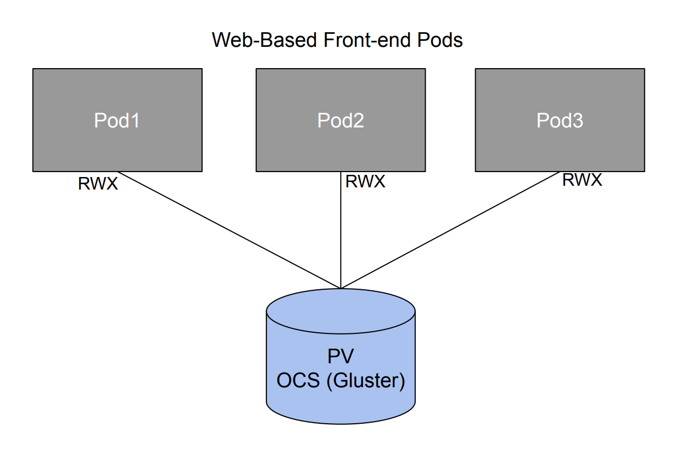

In the source 3.11 cluster terminal, let's examine the application.  Execute the following commands:

```
$ oc get pods -n file-uploader
NAME                    READY   STATUS      RESTARTS   AGE
file-uploader-1-build   0/1     Completed   0          44m
file-uploader-1-gbn49   1/1     Running     0          42m
file-uploader-1-ggjhj   1/1     Running     0          42m
file-uploader-1-rwlbt   1/1     Running     0          42m
```

We can see the 3 replicas running. Next, let's take a look at the storage:

```
$ oc get pvc -n file-uploader
NAME                      STATUS   VOLUME                                     CAPACITY   ACCESS MODES   STORAGECLASS        AGE
file-uploader-vol-claim   Bound    pvc-b660a697-6afe-11ea-a7fb-065ab8be0337   20Gi       RWX            glusterfs-storage   18h
```

We can see that we do indeed have a 20GB Gluster volume mounted RWX to our application pods.

Next, let's get the route to the application, and bring up the webUI.

```
$ oc get route -n file-uploader
NAME            HOST/PORT                                               PATH   SERVICES        PORT       TERMINATION   WILDCARD
file-uploader   file-uploader-file-uploader.apps.12a1.open.redhat.com          file-uploader   8080-tcp                 None
```


Lastly, let's verify that the file-uploader application is **not** running on our destination OCP 4.3 cluster:

```
$ oc get pods -n file-Uploader
No resources found.
```

## 4.1 Migrate with CAM

Next, let's open up the migration UI. Again, to get the route, run the following command on the destination 4.3 cluster terminal:
```bash
$ oc get routes migration -n openshift-migration -o jsonpath='{.spec.host}'
migration-openshift-migration.apps.cluster-d7fd.d7fd.example.opentlc.com
```

The screen should look something like:


*Remember our goal is to migrate our application from OCP/OCS 3 to OCP/OCS 4.  This means moving our data from Gluster to Ceph.  We will show you how to do this in CAM when setting up our migration plan.*

### 4.1.1 Add a Cluster

First thing we want to do is add the source OCP cluster we wish to migrate the
application from. Click `Add` on the Clusters section:

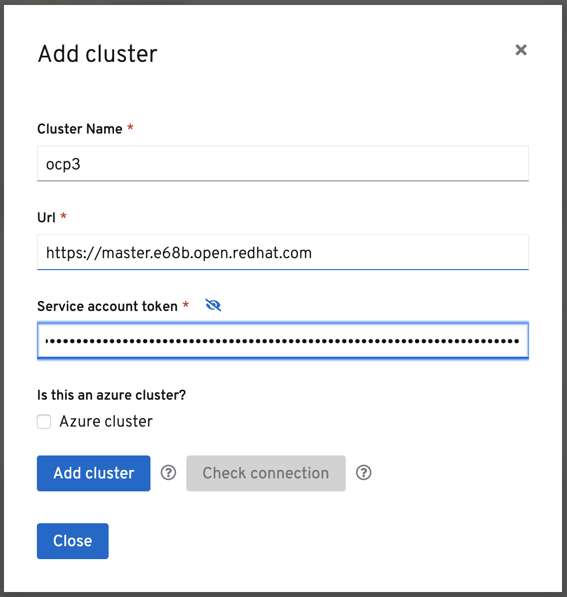

Fill out the necessary information. We will need an Service Account Token in order for destination cluster to talk to source cluster:

`Run the following in the 3.11 cluster terminal.`

```bash
$ oc sa get-token -n openshift-migration mig
eyJhbGciOifsfsds8ahmtpZCI6IiJ9fdsfdseyJpc3MiOiJrdWJlcm5ldGVzL3NlcnZpY2VhY2NvdW50Iiwia3ViZXJuZXRlcy5pby9zZXJ2aWNlYWNjb3VudC9uYW1lc3BhY2UiOiJtaWciLCJrdWJlcm5ldGVzLmlvL3NlcnZpY2VhY2NvdW50L3NlY3JldC5uYW1lIjoibWlnLXRva2VuLTdxMnhjIiwia3ViZXJuZXRlcy5pby9zZXJ2aWNlYWNjb3VudC9zZXJ2aWNlLWFjY291bnQubmFtZSI6Im1pZyIsImt1YmVybmss7gc2VydmljZWFjY291bnQvc2VydmljZS1hY2NvdW50LnVpZCI6IjQ5NjYyZjgxLWEzNDItMTFlOS05NGRjLTA2MDlkNjY4OTQyMCIsInN1YiI6InN5c3RlbTpzZXJ2aWNlYWNjb3VudDptaWc6bWlnIn0.Qhcv0cwP539nSxbhIHFNHen0PNXSfLgBiDMFqt6BvHZBLET_UK0FgwyDxnRYRnDAHdxAGHN3dHxVtwhu-idHKI-mKc7KnyNXDfWe5O0c1xWv63BbEvyXnTNvpJuW1ChUGCY04DBb6iuSVcUMi04Jy_sVez00FCQ56xMSFzy5nLW5QpLFiFOTj2k_4Krcjhs8dgf02dgfkkshshjfgfsdfdsfdsa8fdsgdsfd8fasfdaTScsu4lEDSbMY25rbpr-XqhGcGKwnU58qlmtJcBNT3uffKuxAdgbqa-4zt9cLFeyayTKmelc1MLswlOvu3vvJ2soFx9VzWdPbGRMsjZWWLvJ246oyzwykYlBunYJbX3D_uPfyqoKfzA

# We need to save the output of the 'get-token', that is the long string we will enter into the mig-ui when we create a new cluster entry.
```

When done, click `Add Cluster`. You should see a `Connection successful` message. Click `Close`.

Now you should see the source and destination clusters populated.

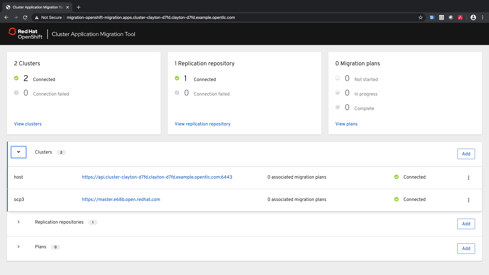

### 4.1.2 Create a Migration Plan

Now that we have a replication repository specified and both the source and
destination clusters defined, we can create a migration plan. Click `Add` in the Plans section:

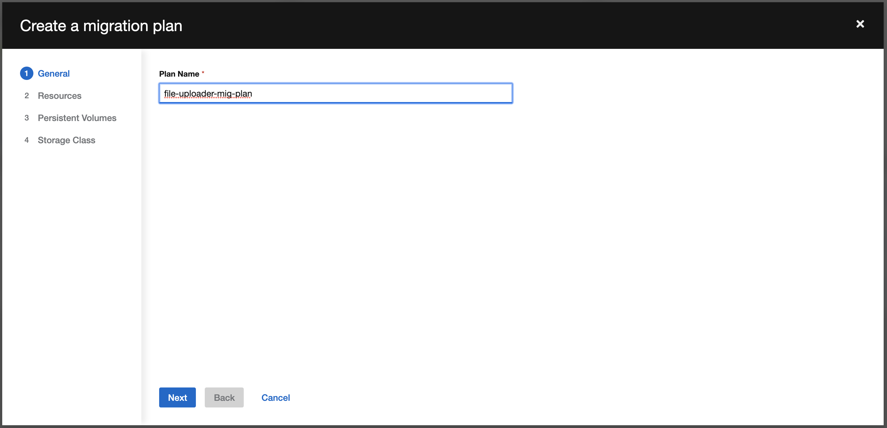

Fill out a plan name. Click Next.

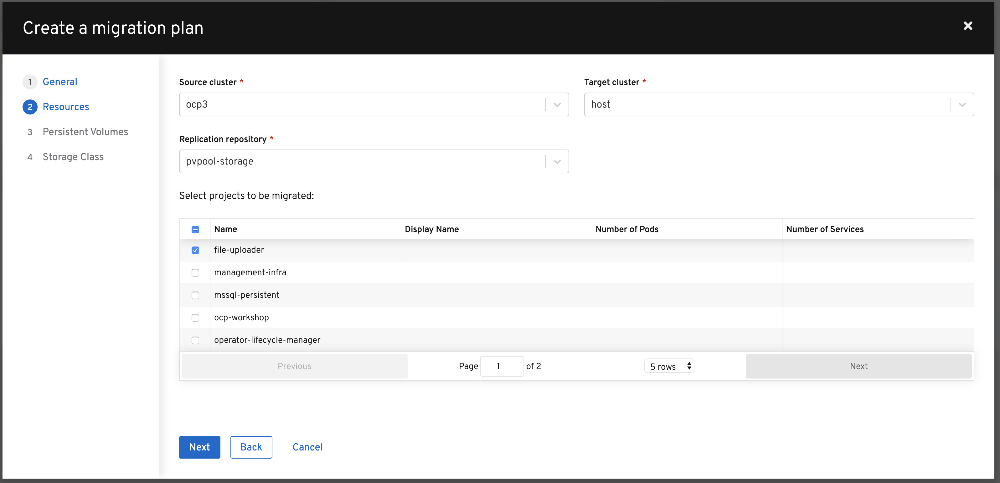

Select the source and target cluster, the replication repository, and the `file-uploader` namespace (which we want to migrate over). Click Next.

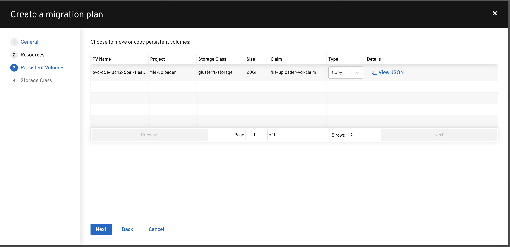

Now we are displayed the OCS3/Gluster persistent volume associated with our
application. For this example, since we are migrating our storage from Gluster to Ceph, let's choose `copy` as our transfer type.

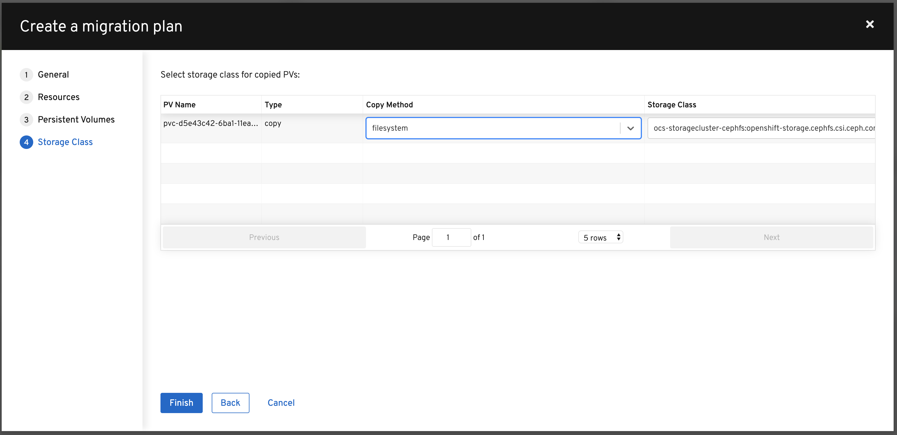

Next, we will need to select the `copy method` and destination `storage class`.  CAM will attempt to pre-select these for you as defaults.  In our case, we want **filesystem** and **ocs-storageclass-cephfs**.

Click Finish.

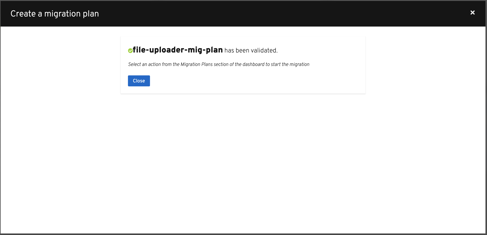

After the migration plan has been successfully validated, you can click `Close`.

### 4.1.3 Migrate the Application Workload

Now we can select `Migrate` or `Stage` on the application. Since we don't care about downtime for this example, let's select `Migrate`:

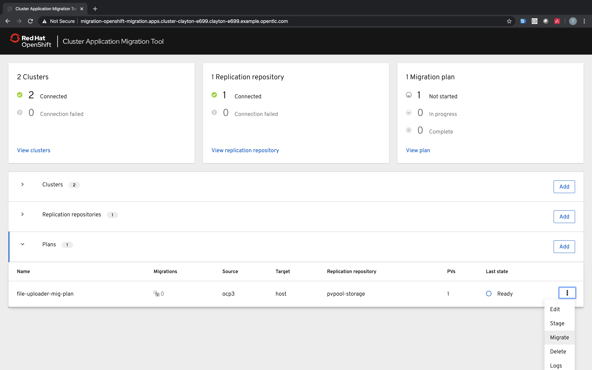

Optionally choose to *not* terminate the application on the source cluster.
Leave it unchecked and select `Migrate`.

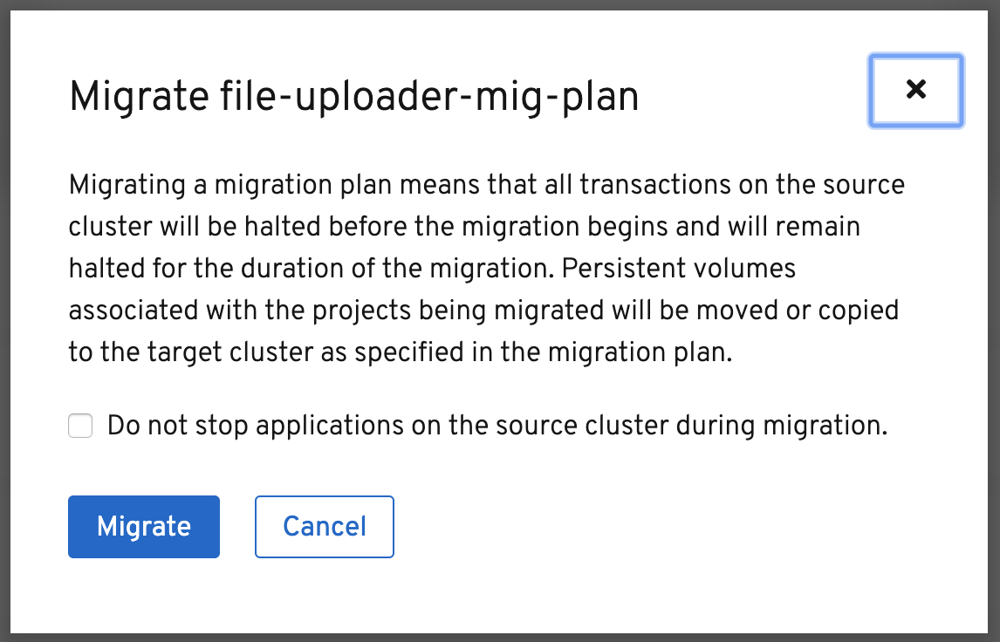

The migration will progress with a progress bar showing each step in the process.

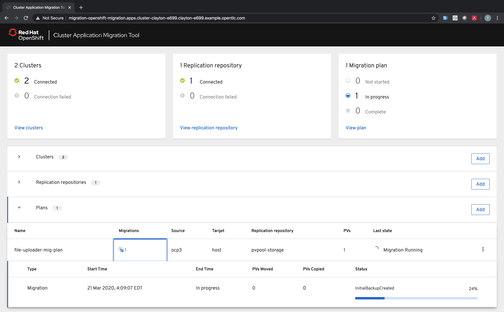

Once done, you should see `Migration Succeeded` on the migration plan.

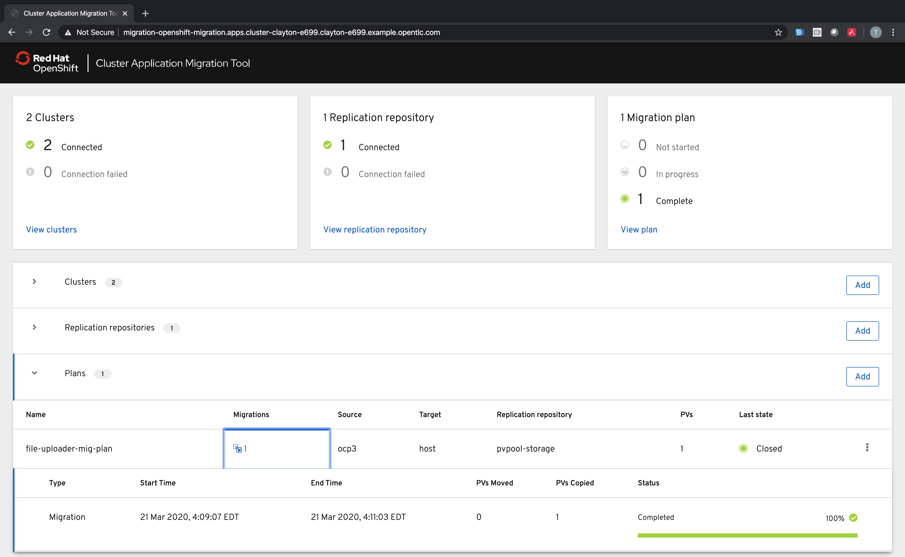


## 4.2 Verify Migrated Application

In the destination 4.3 cluster terminal, let's execute the following commands:

```
$ oc get pods -n file-uploader
NAME                     READY   STATUS      RESTARTS   AGE
file-uploader-1-build    1/1     Running     0          96s
file-uploader-1-deploy   0/1     Completed   0          95s
file-uploader-1-rc49v    1/1     Running     0          93s
file-uploader-1-vf2pt    1/1     Running     0          93s
file-uploader-1-zbt6d    1/1     Running     0          93s
```

We see that the file-uploader application is running.

Let's check the storage:

```
$ oc get pvc -n file-uploader
NAME                      STATUS   VOLUME                                     CAPACITY   ACCESS MODES   STORAGECLASS                AGE
file-uploader-vol-claim   Bound    pvc-ff900007-c557-404c-852e-fca8bb4a5123   20Gi       RWX            ocs-storagecluster-cephfs   2m23s
```

We see that our 20GB volume has been moved and is now running on Ceph.

Lastly, let's grab the route and open up the WebUI in our browser.

```
$ oc get route -n file-uploader
NAME            HOST/PORT                                                                                PATH   SERVICES        PORT       TERMINATION   WILDCARD
file-uploader   file-uploader-file-uploader.apps.cluster-clayton-e699.clayton-e699.example.opentlc.com          file-uploader   8080-tcp                 None
```


**Success!**  You have now successfully migrated your first application using CAM.  

Next Lab: [Lab 5 - Migrate MSSQL Server Application](./5.md)<br>
Previous Lab: [Lab 3 - CAM Overview](./3.md)<br>
[Home](./README.md)
