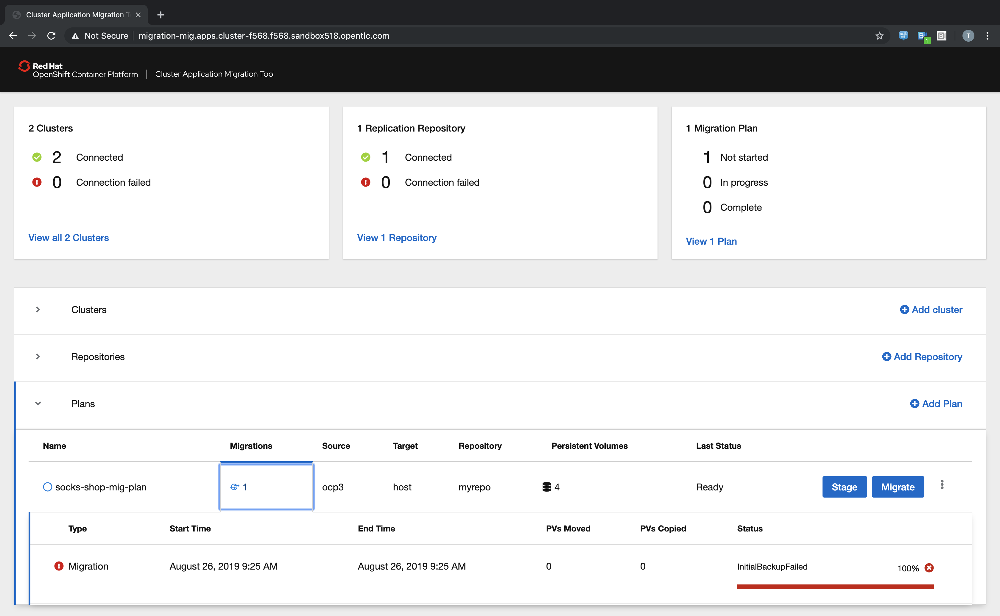
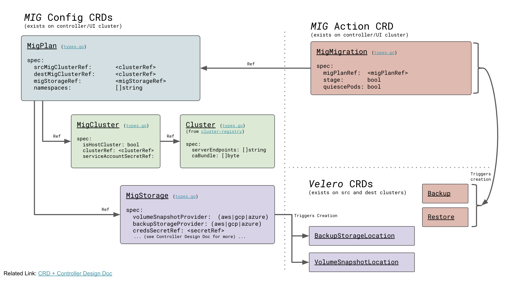

# 7.0 Debugging Failed Migrations

Most of the time migrations go as planned, but knowing what to do when they don't is critical.  This lab attempts to provide you with a process/guide to follow when investigating a failed migration.



## 7.1 CRD Architecture



It's important to first understand the custom resources in play.  The above architecture diagram illustrates the migration resources and their relationships.  Most of our debugging failed migration executions will focus on the right-side of the diagram:
 * MigMigration
 * Velero - Backup and Restore

## 7.1 Workflow

Upon execution of a Migration Plan (stage or migrate), a `MigMigration` is created.  This custom resource is created for each distinct run; and is created on the same cluster where the migration-controller that is orchestrating the migration is running.

Let's take a look at the existing MigMigrations.  On our 4.1 cluster, perform the following:

```bash
oc get migmigration -n mig
NAME                                   AGE
88435fe0-c9f8-11e9-85e6-5d593ce65e10   6m42s
```
Once you found the appropriate migration execution that you want to investigate, you can request more detail:

```bash
$ oc describe migmigration 88435fe0-c9f8-11e9-85e6-5d593ce65e10 -n mig
Name:         88435fe0-c9f8-11e9-85e6-5d593ce65e10
Namespace:    mig
Labels:       <none>
Annotations:  touch: 3b48b543-b53e-4e44-9d34-33563f0f8147
API Version:  migration.openshift.io/v1alpha1
Kind:         MigMigration
Metadata:
  Creation Timestamp:  2019-08-29T01:01:29Z
  Generation:          20
  Resource Version:    88179
  Self Link:           /apis/migration.openshift.io/v1alpha1/namespaces/mig/migmigrations/88435fe0-c9f8-11e9-85e6-5d593ce65e10
  UID:                 8886de4c-c9f8-11e9-95ad-0205fe66cbb6
Spec:
  Mig Plan Ref:
    Name:        socks-shop-mig-plan
    Namespace:   mig
  Quiesce Pods:  true
  Stage:         false
Status:
  Conditions:
    Category:              Advisory
    Durable:               true
    Last Transition Time:  2019-08-29T01:03:40Z
    Message:               The migration has completed successfully.
    Reason:                Completed
    Status:                True
    Type:                  Succeeded
  Phase:                   Completed
  Start Timestamp:         2019-08-29T01:01:29Z
Events:                    <none>
```
This `MigMigration` describes a successful execution of the socks-shop-mig-plan.

The mig-controller will orchestrate actions on both the source and target clusters.  These actions are as follows:

### 7.1.1 Source Cluster

Two Velero Backup CRs are created:

`Backup #1`:

1. Do an initial backup of k8s resources via Velero (no PV data).
1. Annotate all pods with PVs to track what we want to backup.

`Backup #2`:

1. If quiesce is selected, scale app down to zero:
  *  Scales down to zero, Deployment, DeploymentConfig, Job, Statefulset, etc…..all but pods.   
  * Standalone pods are left alone, hope is there are minimal of these and most people will use Deployment/ReplicaSets so we can scale to zero.  
  * If they had a standalone pod the user is responsible for manual quiesce as they need.


2. Launch ‘stage’ pods, these are used for both stage and migrate, they are a dummy/sleeper pod that just sleeps and mounts the data so we can backup.

3. Do a backup of ‘PV’ data via Velero.


***Note: Velero will sync these Backup CRs between source and target clusters, so they will appear on both clusters.***

### 7.1.2 Target Cluster

Two Velero Restore CRs are created:

`Restore #1`:

1. (Uses Backup #2) -- Restore just the PV data to destination cluster.
  * Do a restore of ‘PV data’, this would be a restore of ‘Backup #2’ above

`Restore #2`:

1. (Uses Backup #1) -- Restore the k8s resources to the destination cluster.

## 7.2 Examining Velero Custom Resources

Let's take a look at these Velero CRs on our 4.1 Cluster:

### 7.2.1 Backup

The Velero CRs will contain references to the associated MigMigration.  We can use the UID of the MigMigration, under Metadata, to query the relevant objects:

```bash
$ oc get backup -n mig -l migmigration=8886de4c-c9f8-11e9-95ad-0205fe66cbb6
NAME                                         AGE
88435fe0-c9f8-11e9-85e6-5d593ce65e10-59gb7   36m  //Backup 2
88435fe0-c9f8-11e9-85e6-5d593ce65e10-vdjb7   37m  //Backup 1
```

```bash
$ oc get backup 88435fe0-c9f8-11e9-85e6-5d593ce65e10-59gb7  -n mig -o yaml
apiVersion: velero.io/v1
kind: Backup
metadata:
  annotations:
    openshift.io/migrate-copy-phase: final
    openshift.io/migrate-quiesce-pods: "true"
    openshift.io/migration-registry: 172.30.105.179:5000
    openshift.io/migration-registry-dir: /socks-shop-mig-plan-registry-44dd3bd5-c9f8-11e9-95ad-0205fe66cbb6
  creationTimestamp: "2019-08-29T01:03:15Z"
  generateName: 88435fe0-c9f8-11e9-85e6-5d593ce65e10-
  generation: 1
  labels:
    app.kubernetes.io/part-of: migration
    migmigration: 8886de4c-c9f8-11e9-95ad-0205fe66cbb6
    migration-stage-backup: 8886de4c-c9f8-11e9-95ad-0205fe66cbb6
    velero.io/storage-location: myrepo-vpzq9
  name: 88435fe0-c9f8-11e9-85e6-5d593ce65e10-59gb7
  namespace: mig
  resourceVersion: "87313"
  selfLink: /apis/velero.io/v1/namespaces/mig/backups/88435fe0-c9f8-11e9-85e6-5d593ce65e10-59gb7
  uid: c80dbbc0-c9f8-11e9-95ad-0205fe66cbb6
spec:
  excludedNamespaces: []
  excludedResources: []
  hooks:
    resources: []
  includeClusterResources: null
  includedNamespaces:
  - sock-shop
  includedResources:
  - persistentvolumes
  - persistentvolumeclaims
  - namespaces
  - imagestreams
  - imagestreamtags
  - secrets
  - configmaps
  - pods
  labelSelector:
    matchLabels:
      migration-included-stage-backup: 8886de4c-c9f8-11e9-95ad-0205fe66cbb6
  storageLocation: myrepo-vpzq9
  ttl: 720h0m0s
  volumeSnapshotLocations:
  - myrepo-wv6fx
status:
  completionTimestamp: "2019-08-29T01:02:36Z"
  errors: 0
  expiration: "2019-09-28T01:02:35Z"
  phase: Completed
  startTimestamp: "2019-08-29T01:02:35Z"
  validationErrors: null
  version: 1
  volumeSnapshotsAttempted: 0
  volumeSnapshotsCompleted: 0
  warnings: 0
```

### 7.2.2 Restore

```bash
oc get restore -n mig -l migmigration=8886de4c-c9f8-11e9-95ad-0205fe66cbb6
NAME                                         AGE
e13a1b60-c927-11e9-9555-d129df7f3b96-gb8nx   15m //Restore 2
e13a1b60-c927-11e9-9555-d129df7f3b96-qnqdt   15m //Restore 1
```

```bash
oc get restore e13a1b60-c927-11e9-9555-d129df7f3b96-gb8nx  -n mig -o yaml
apiVersion: velero.io/v1
kind: Restore
metadata:
  annotations:
    openshift.io/migrate-copy-phase: final
    openshift.io/migrate-quiesce-pods: "true"
    openshift.io/migration-registry: 172.30.90.187:5000
    openshift.io/migration-registry-dir: /socks-shop-mig-plan-registry-36f54ca7-c925-11e9-825a-06fa9fb68c88
  creationTimestamp: "2019-08-28T00:09:49Z"
  generateName: e13a1b60-c927-11e9-9555-d129df7f3b96-
  generation: 3
  labels:
    app.kubernetes.io/part-of: migration
    migmigration: e18252c9-c927-11e9-825a-06fa9fb68c88
    migration-final-restore: e18252c9-c927-11e9-825a-06fa9fb68c88
  name: e13a1b60-c927-11e9-9555-d129df7f3b96-gb8nx
  namespace: mig
  resourceVersion: "82329"
  selfLink: /apis/velero.io/v1/namespaces/mig/restores/e13a1b60-c927-11e9-9555-d129df7f3b96-gb8nx
  uid: 26983ec0-c928-11e9-825a-06fa9fb68c88
spec:
  backupName: e13a1b60-c927-11e9-9555-d129df7f3b96-sz24f
  excludedNamespaces: null
  excludedResources:
  - nodes
  - events
  - events.events.k8s.io
  - backups.velero.io
  - restores.velero.io
  - resticrepositories.velero.io
  includedNamespaces: null
  includedResources: null
  namespaceMapping: null
  restorePVs: true
status:
  errors: 0
  failureReason: ""
  phase: Completed
  validationErrors: null
  warnings: 15
```

## 7.3 Controller Logs

Another area we can examine to assist in debugging migration issues is the controller logs.  

### 7.3.1 Migration Controller Logs

```bash
oc get pods -n mig | grep controller
controller-manager-78c469849c-v6wcf           1/1     Running     0          4h49m
```
```bash
oc logs controller-manager-78c469849c-v6wcf -f -n mig
```

### 7.3.2 Velero Controller Logs

```bash
$ oc get pods -n mig | grep velero
velero-7659c69dd7-ctb5x                       1/1     Running     0          4h46m
```
```bash
oc logs velero-7659c69dd7-ctb5x -f -n mig
```

### 7.3.3 Restic Controller Logs

```bash
$ oc get pods -n mig | grep restic
restic-t4f9b                                  1/1     Running     0          4h47m
```
```bash
oc logs restic-t4f9b -f -n mig
```

Next, we've added an optional lab covering multi-namespace migrations and using the API directly for large scale operations.

Next Lab: [Lab 8 - Migration at Scale via API (optional)](./8.md)<br>
Previous Lab: [Lab 6 - Migrate Sock Shop Application](./6.md)<br>
[Home](./README.md)
